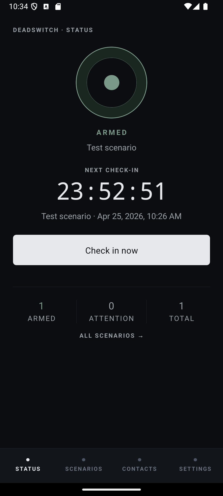
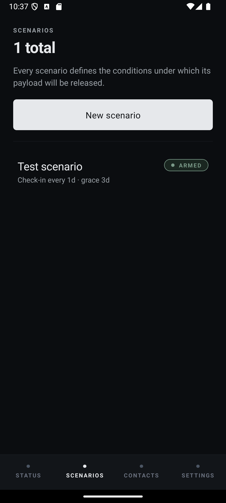
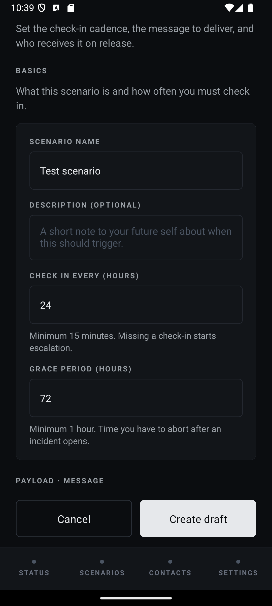
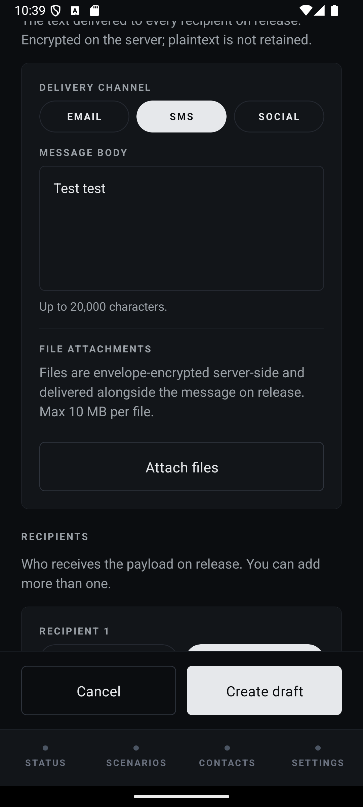
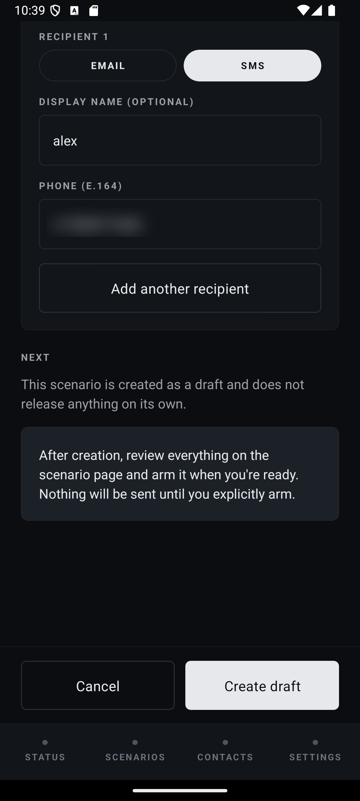
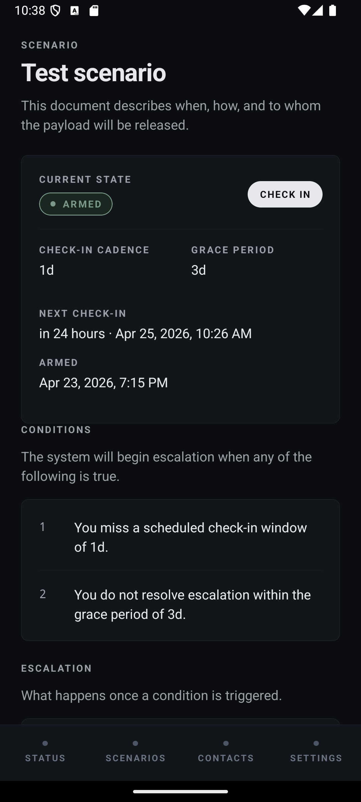
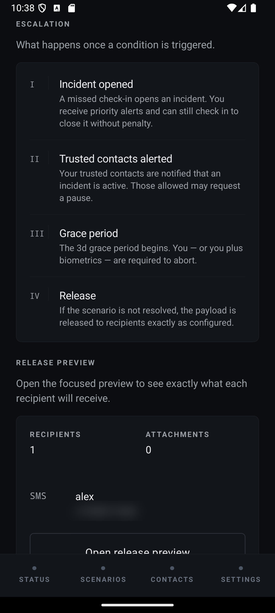
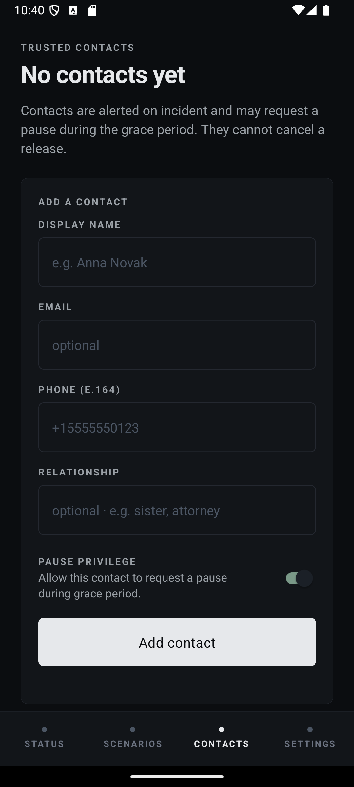
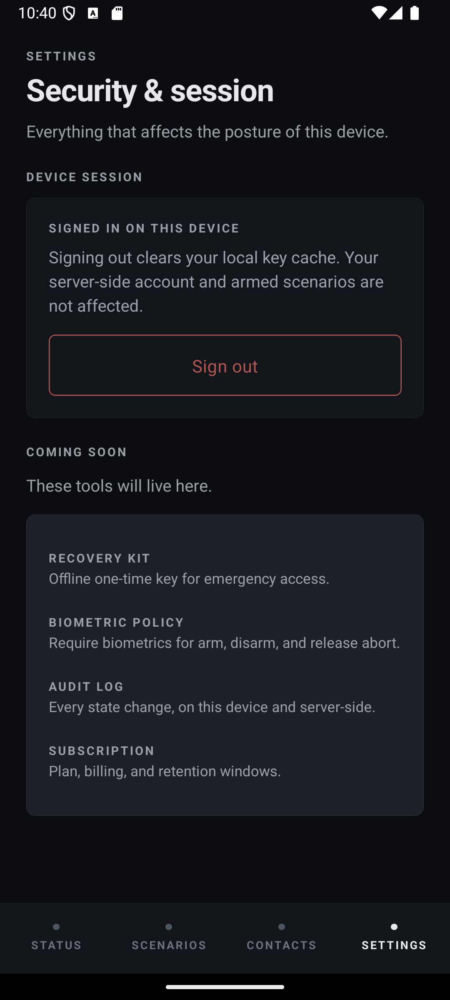

# DeadSwitch

A scenario-based digital dead man's switch.

DeadSwitch lets a user arm one or more **scenarios** (e.g. "solo travel," "legal risk," "medical"). Each scenario requires periodic check-ins. If the user stops responding — through push, SMS, and voice escalation, across a grace period — the system executes a **release**: sending pre-composed emails, SMS messages, and encrypted payloads to the recipients the user configured.

This is a high-trust system. A false-positive release is not recoverable in the general case (a sent email cannot be unsent), and a false-negative means the system failed the user at the one moment it existed for. The design prioritises **correctness, safety, and auditability over availability and convenience**. Most of this README is about how we earn that tradeoff and where we explicitly fall short.

> **Status:** v1. Single-region deployment, limited social integrations, no public disclosure primitives beyond direct delivery to specified recipients.

<p align="center">
  
</p>

---

## Table of Contents

1. [Project Overview](#1-project-overview)
2. [Core Concepts](#2-core-concepts)
3. [System Architecture](#3-system-architecture)
4. [Security Model](#4-security-model)
5. [State Machine and Release Flow](#5-state-machine-and-release-flow)
6. [Safety and Containment](#6-safety-and-containment)
7. [Audit and Observability](#7-audit-and-observability)
8. [Operator Controls](#8-operator-controls)
9. [Failure Modes and Tradeoffs](#9-failure-modes-and-tradeoffs)
10. [Mobile Design System](#10-mobile-design-system)
11. [Local Development Setup](#11-local-development-setup)
12. [Testing Strategy](#12-testing-strategy)
13. [Deployment Notes](#13-deployment-notes)
14. [Future Work](#14-future-work)
15. [License](#15-license)

---

## 1. Project Overview

DeadSwitch has three deliverables:

- **Mobile app** (Expo / React Native). Primary interface. Owns the user's private vault key material. Handles check-ins, scenario management, and vault editing.
- **Backend API** (NestJS + Prisma + Postgres). Stateful authority. Owns scenarios, check-in state, the outbox, audit log, and encrypted action payloads. Never sees plaintext vault content.
- **Workers** (BullMQ on Redis). Dispatch escalations, evaluate state transitions, and execute release under strict chokepoint enforcement.

External dependencies: Twilio (SMS + voice), SendGrid (email), S3-compatible object storage (ciphertext blobs), AWS KMS (wrapping keys for action payloads and audit sink).

Monorepo layout:

```
apps/
  api/          NestJS service + workers
  mobile/       Expo app
packages/
  shared/       Types + zod schemas + protocol constants
```

---

## 2. Core Concepts

### 2.1 Scenarios

A **Scenario** is the unit of arming. It is **time-bound** — auto-expiry is opt-in — and intended to be reviewed, not fire-and-forget.

Fields (see [apps/api/prisma/schema.prisma](apps/api/prisma/schema.prisma) for the authoritative list):

- `checkinIntervalSeconds`: how often check-ins are required (minimum 15 minutes, enforced server-side)
- `gracePeriodSeconds`: how long after a missed check-in before escalation begins (minimum 1 hour in dev, 6 hours default in prod)
- `autoExpireAt`: optional hard expiry; past this timestamp the scenario auto-disarms
- `bundles`: one or more **Release Bundles** — each holds recipients + the encrypted payload for those recipients (§2.3)
- `state`: the scenario's position in the state machine (§5.1)

A scenario only transitions from `armed` to `release_in_progress` if **all** of the following hold:

1. The scenario is in the `grace_period` state (arrived there via the full ladder, not by direct jump)
2. The grace period has elapsed without a successful check-in
3. Every prior ladder stage (`incident_pending`, `escalation_in_progress`) was entered and either timed out or did not recover
4. The system's current `SafetyMode` permits release

Each of those is checked independently at the transition point, not precomputed — the release worker reloads and revalidates immediately before dispatch.

### 2.2 Check-ins

A check-in is a signed, timestamped message from the mobile app, authenticated by a long-lived device credential plus a short-lived session token. A check-in:

- is idempotent on `(user_id, scenario_id, client_nonce)`
- resets the scenario's `last_checkin_at`
- is replicated synchronously to Postgres before acknowledgement
- is append-only in the audit log

A check-in can be performed from multiple devices; the server accepts the latest and records all.

### 2.3 Release Bundles

A **Release Bundle** is the payload executed when a scenario fires. A bundle contains:

- `BundleMessage`s — short text payloads (email / sms / social). Stored as ciphertext; the server envelope-seals the plaintext at ingest and cannot hand it back to anyone but the release worker.
- `BundleAttachment`s — file attachments (up to 10 MB). Uploaded via multipart, envelope-sealed server-side by the same KMS-backed flow, then written to local blob storage in dev (`apps/api/data/blobs/`) or object storage in prod. The DB row stores only the blob reference, SHA-256 of the ciphertext, size, mime type, and encryption mode.
- `PrivateVaultItem`s — true end-to-end encrypted items. The client uploads ciphertext + a DEK wrapped by the user's device key; the server cannot unwrap and cannot deliver without a `TrustedContactGrant`. Distinct from the server-sealed path above — see §4.

Each sendable action is **independently idempotent** on `(bundle_id, action_id, recipient_id)` and tracked in the outbox. An action's terminal state is `executed`, `failed_permanent`, `aborted`, `suppressed`, or `sent_after_abort` (recorded when a send completed between an abort request and the worker observing it).

### 2.4 Recipients

A recipient is a `(recipientKind, address, displayName?)` triple attached to a bundle. `recipientKind` is one of `email`, `sms`, `secure_link`, or `social_handle`. Recipients are added directly on the bundle; editing a recipient after arming is possible while the scenario is in `draft`, but locked thereafter — an armed scenario's delivery list is frozen.

---

## 3. System Architecture

### 3.1 High-level

```
               ┌──────────────────────────────────────────┐
               │                  Mobile                  │
               │  (Expo) — holds vault keys, signs        │
               │  check-ins, composes bundles locally     │
               └──────────────┬───────────────────────────┘
                              │  HTTPS (mTLS-optional) + JWT
                              ▼
    ┌─────────────────────────────────────────────────────┐
    │                   API (NestJS)                       │
    │  ┌────────────┐  ┌─────────────┐  ┌──────────────┐  │
    │  │  Auth +    │  │  Scenarios  │  │   Outbox     │  │
    │  │  Sessions  │  │  + CAS SM   │  │   (tx'd)     │  │
    │  └────────────┘  └─────────────┘  └──────────────┘  │
    │  ┌────────────┐  ┌─────────────┐  ┌──────────────┐  │
    │  │ Capability │  │  SafetyMode │  │  Audit Chain │  │
    │  │  Enforcer  │  │  Controller │  │  (hash-link) │  │
    │  └────────────┘  └─────────────┘  └──────────────┘  │
    └───────────┬─────────────────────┬────────────────────┘
                │ Postgres            │ BullMQ (Redis)
                ▼                     ▼
    ┌───────────────────┐   ┌──────────────────────────────┐
    │     Postgres      │   │           Workers             │
    │  (source of truth │   │  ┌────────────┐ ┌──────────┐ │
    │   incl. outbox +  │   │  │ check-ins  │ │ escalate │ │
    │   audit chain)    │   │  └────────────┘ └──────────┘ │
    └───────────────────┘   │  ┌────────────────────────┐  │
                            │  │  release (chokepoint)  │  │
                            │  └────────────────────────┘  │
                            └──────────┬───────────────────┘
                                       │
                   ┌───────────────────┼────────────────────┐
                   ▼                   ▼                    ▼
              ┌─────────┐         ┌────────┐          ┌───────────┐
              │ Twilio  │         │SendGrid│          │    S3     │
              └─────────┘         └────────┘          └───────────┘
                   │                   │                    │
                   └─────── external WORM audit sink ◄──────┘
```

### 3.2 Mobile (Expo)

- Generates and stores the user's **private vault key** in the OS secure enclave (Keychain/Keystore). This key never leaves the device in plaintext.
- Performs client-side encryption for all vault content. The server sees only ciphertext for vault material.
- Composes release bundles locally and uploads ciphertext + wrapped keys (see §4).
- Check-ins are signed by a device-scoped Ed25519 key registered at enrolment.
- Offline-tolerant for check-ins: queued with client-side monotonic clock and replayed when connectivity returns. Server enforces replay protection.

### 3.3 Backend (NestJS)

- Prisma over Postgres for everything stateful.
- Requests pass through a **capability enforcer** (deny-by-default; every route declares the capabilities it requires).
- All state-changing endpoints use **compare-and-swap** on a version column; there is no "last write wins."
- Destructive or release-adjacent operations go through a **chokepoint** service that additionally consults the SafetyMode controller before proceeding.
- Rate limits and quotas are enforced per-user and per-scenario; SMS and voice have hard daily ceilings independent of user configuration.

### 3.4 Workers

Three BullMQ workers, each running as its own process:

- **check-ins worker** — advances `awaiting_checkin` → `late` / `escalating` based on elapsed time and scenario cadence. Pure state evaluation; produces outbox rows.
- **escalation worker** — drains outbox rows for escalation notifications. Calls Twilio/SendGrid with idempotency keys. Honours circuit breakers per provider.
- **release worker** — the only component authorised to execute release actions. Acquires a per-scenario lease, revalidates *all* preconditions, decrypts action payloads, dispatches, and writes terminal outbox state. Any failure short of explicit user cancellation is retried with exponential backoff and logged.

Workers are idempotent on outbox row + attempt. A crash mid-send can cause a duplicate provider submission; we treat this as acceptable and document it — see §9.

---

## 4. Security Model

DeadSwitch has **two distinct encryption regimes** with different threat models. Confusing them is the single biggest source of bugs in a system like this, so they are kept rigorously separated in code and in this document.

### 4.1 Private vault — server-blind, true client-side encryption

The private vault holds the user's notes, personal instructions, and any content the user wants encrypted end-to-end.

- Master key is derived on device from the user's password via Argon2id (parameters pinned in `packages/shared`).
- All vault records are encrypted with XChaCha20-Poly1305 using per-record subkeys derived from the master key.
- The server stores only ciphertext and KDF parameters. The server cannot decrypt the vault. Password reset without a recovery kit = permanent vault loss; this is intentional.
- For release delivery, the user can mark vault entries for inclusion as `vault_share` actions. A share is produced client-side by re-encrypting the entry under the recipient's public key before upload.

### 4.2 Action payloads — server-mediated, released under policy

Action payloads (email bodies, SMS text, attachment blobs) are what actually get transmitted to recipients during a release. These cannot be end-to-end encrypted from the user to the recipient in the general case — recipients may only have an email address. So they need a different model.

- Action payloads are encrypted at rest with a **per-record DEK** generated at ingest.
- The DEK is wrapped with a **KMS CMK** (AWS KMS, dedicated key per environment).
- The release worker — and only the release worker — has the IAM policy to `kms:Decrypt` that CMK. The API process does not.
- Decryption is scoped to the moment of dispatch. Plaintext is held in a short-lived buffer and zeroed after use (best-effort; see §9).
- Dispatch goes out over TLS to the provider. At this point the plaintext exists on Twilio/SendGrid servers. This is unavoidable given the delivery mechanism and is documented as part of the threat model.

**Attachments** (files) ride the same path with `encryptionMode = action_envelope`. At upload the API envelope-seals the bytes, writes the ciphertext to blob storage (local disk in dev, S3 in prod), and records `{ blobRef, ciphertextHash, sizeBytes, mimeType, encryptionMode, aadVersion }`. AAD binds `bundleId | attachmentId | mimeType | displayFilename` so a tampered DB row cannot silently relabel a file. This path is distinct from `PrivateVaultItem` (§4.1), which the server genuinely cannot decrypt.

### 4.3 Key handling summary

| Key | Location | Access | Purpose |
|---|---|---|---|
| User password | User's memory | User only | Derives vault master key |
| Vault master key | Device enclave | Device only | Encrypts vault records |
| Recipient public key | DB (associated with recipient) | Public | Encrypts `vault_share` actions |
| Bundle DEK | DB (wrapped) | Release worker via KMS | Encrypts action payloads |
| KMS CMK | AWS KMS | Release worker IAM role only | Wraps bundle DEKs |
| Audit sink key | KMS, separate CMK | External WORM sink writer | Signs audit exports |
| Device signing key | Device enclave | Device only | Signs check-ins |

### 4.4 KMS usage

- Separate CMKs per environment (`dev`, `staging`, `prod`). No cross-environment rewrapping.
- KMS key policies grant `Decrypt` only to the release worker's task role, and `Encrypt` / `GenerateDataKey` only to the API's task role.
- All KMS calls are logged to CloudTrail; a scheduled reconciliation job compares CloudTrail `Decrypt` events against release worker dispatch records and alerts on divergence.

---

## 5. State Machine and Release Flow

### 5.1 Scenario states

States are defined by the `ScenarioState` enum in [schema.prisma](apps/api/prisma/schema.prisma). `aborted`, `released`, and `expired` are terminal.

```
      ┌───────────┐   delete (draft only)
      │   draft   │ ──────────────────────► (removed)
      └─────┬─────┘
            │ arm()
            ▼
      ┌──────────────────┐       disarm()         ┌───────────┐
      │      armed       │ ─────────────────────► │  aborted  │
      └─────┬────────────┘                        └───────────┘
            │ missed check-in                           ▲
            ▼                                           │
      ┌──────────────────┐        check-in              │
      │ incident_pending │ ─────────────────────► armed │
      └─────┬────────────┘                              │
            │ incident unresolved                       │
            ▼                                           │
      ┌─────────────────────────┐     check-in          │
      │ escalation_in_progress  │ ────────────► armed   │
      └─────┬───────────────────┘                       │
            │ escalation exhausted                      │
            ▼                                           │
      ┌───────────────┐  check-in / abort_code / disarm │
      │ grace_period  │ ────────────────────────────────┘
      └─────┬─────────┘
            │ grace expired
            ▼
      ┌─────────────────────┐
      │ release_in_progress │
      └─────┬───────────────┘
            │ all release actions terminal
            ▼
      ┌───────────┐
      │ released  │
      └───────────┘
```

Drafts can be **deleted outright** (`DELETE /scenarios/:id`) — they have no external commitments yet. Every other non-terminal state requires the disarm / abort flow, which moves the scenario to `aborted` (terminal) and preserves the full audit trail.

### 5.2 Transition guarantees

- Every transition is an `UPDATE ... WHERE version = :expected` (CAS). A transition that loses the race is retried against freshly loaded state, not silently dropped.
- `armed → late → escalating → releasing` are evaluated **server-side by the check-ins worker**, not by the mobile client. A silent client cannot delay release; a hostile client cannot accelerate it.
- Only the `releasing` transition enqueues the release job. It does so in the same Postgres transaction as the state change (outbox pattern): the job is enqueued iff the state moved.
- `releasing → released` requires **every** action in the bundle to reach a terminal state. Partial release is a first-class state — it is reported, audited, and does not silently "complete."
- `aborted` is terminal for that scenario instance. Re-arming requires creating a new scenario.

### 5.3 Release ladder

A single missed check-in does **not** trigger release. The ladder is intentionally conservative:

| Stage | Default timing | Channel | User can cancel by |
|---|---|---|---|
| 1. Grace | `grace_period` (e.g. 2h) | silent | any check-in |
| 2. Push | immediate on grace expiry, repeated | push notification | any check-in |
| 3. SMS | +30 min if no response to push | Twilio SMS | check-in or SMS reply |
| 4. Call | +60 min if no response to SMS | Twilio voice | check-in or IVR confirm |
| 5. Release | +N hours after call completes (scenario-configurable, min 1h) | — | check-in until release worker acquires lease |

Each stage's timing is scenario-configurable with a pinned **minimum** — users cannot set a cadence so tight that a flaky network guarantees release. The minimums are enforced at scenario creation and at every renewal.

### 5.4 Release worker flow

```
1. Acquire scenario lease (Redis, TTL-bounded).
2. Reload scenario + bundle from Postgres.
3. Revalidate every precondition (state == releasing, SafetyMode permits, quotas, circuit breakers).
   If any fails → release state unchanged, log, exit. Do NOT retry blindly.
4. For each action in bundle:
   a. Claim outbox row (CAS).
   b. Unwrap bundle DEK via KMS.
   c. Decrypt payload.
   d. Call provider with idempotency key = (bundle_id, action_id, recipient_id, attempt_epoch).
   e. Record provider message id + terminal status.
   f. Zeroize payload buffer.
5. When all actions terminal → CAS scenario to released. Emit audit event.
```

---

## 6. Safety and Containment

DeadSwitch is designed to **fail closed**. If the system cannot verify that a release is safe to execute, it does not execute it. This section is the most important part of the design and the part most likely to be wrong; reviewers should spend time here.

### 6.1 SafetyMode

SafetyMode is a global enum that gates every capability. Transitions are themselves audited.

| Mode | Meaning | Effect |
|---|---|---|
| `normal` | baseline | all capabilities available per policy |
| `degraded` | one or more external dependencies unhealthy | new arms blocked; existing scenarios continue; release requires extra revalidation |
| `release_restricted` | anomaly threshold exceeded in release activity | release worker refuses to dispatch; escalations continue so users are informed |
| `audit_compromised` | audit chain integrity check failed or WORM sink unreachable beyond SLO | no releases, no destructive operator actions, read-only API for users |
| `emergency_freeze` | operator-triggered or auto-triggered global halt | all workers pause; API returns 503 for state-changing ops; check-ins accepted and logged but no transitions |

**Rule:** a mode can never be downgraded (e.g. `audit_compromised → normal`) by a single operator. Downgrades require **dual control** (§8) and a passing integrity re-check.

### 6.2 Automated containment triggers

The controller promotes SafetyMode automatically on:

- release rate exceeding a rolling baseline by a configured factor
- audit chain hash mismatch on any read
- WORM sink write failures beyond a sliding-window threshold
- KMS `Decrypt` denials from the release worker role
- mass scenario arming from a single account or IP (anti-abuse)
- provider circuit breakers all open simultaneously

Each trigger has a corresponding target mode; the strictest outstanding trigger wins.

### 6.3 Circuit breakers

Per-provider (Twilio SMS, Twilio voice, SendGrid, S3, KMS). Standard three-state (closed / open / half-open). Breaker state is persisted and surfaced in `/metrics`.

Interaction with release: if a breaker relevant to a release action is `open`, the action is **parked** (not failed). It retries after the breaker closes, up to a scenario-configured wall-clock ceiling. Past the ceiling the action is marked `failed_permanent` and the release proceeds as partial.

### 6.4 Capability-based enforcement

Every API route and every internal service method declares the capabilities it requires. The enforcer resolves the current principal (user, operator, worker role) against the active SafetyMode and either permits or denies. Denials are logged with the capability name and current mode — there is no implicit allow.

### 6.5 Chokepoint architecture

All release dispatch flows through a single `ReleaseChokepoint` service. There is exactly one code path that can call `twilio.send` or `sendgrid.send` in a release context, and it is this one. Escalation sends use a separate code path with its own rate limits; they cannot be repurposed to send release content.

### 6.6 Blast radius controls

- Per-user daily caps on SMS/email/voice independent of user configuration.
- Per-recipient dedupe: the same recipient cannot receive more than N release actions from the same user per window.
- Global daily caps per-provider; exceeding a global cap promotes SafetyMode to `release_restricted`.
- No bulk scenario operations — every arm/disarm is per-scenario and audited individually.

---

## 7. Audit and Observability

### 7.1 Audit chain

Every state-changing event writes an audit record with:

- monotonic sequence number per chain scope (`scenario:<id>` or `user:<id>`)
- event type and payload hash
- `prev_hash` = hash of the previous record
- signature over `(seq, event, prev_hash)` using the audit signing key

This is a hash chain, not a Merkle tree. It gives us **tamper detection**, not tamper prevention; see §9.

`AuditEvent` is enforced as **append-only** at the database level — a Postgres trigger refuses any `UPDATE` or `DELETE`, and the application role is GRANTed only `SELECT` + `INSERT`. As a consequence, `AuditEvent.scenarioId` is a **plain historical pointer**, not a live foreign key: draft deletion (§5.1) must not cascade into audit rows, since the trigger would (correctly) refuse. Queries that filter by scenario still work via an index; the value just outlives the subject.

### 7.2 External WORM sink

Audit records are mirrored asynchronously to an append-only, write-once external sink (S3 Object Lock in compliance mode, with object-level KMS signing). The sink is owned by a separate AWS account to limit blast radius from a compromise of the primary account.

A reconciliation job:

- confirms every local audit row has a corresponding WORM object
- recomputes the chain and compares to the stored signatures
- on mismatch or gap beyond SLO, promotes SafetyMode to `audit_compromised`

### 7.3 Logging and metrics

- Structured logs via `pino`. No user vault plaintext, no action payload plaintext, no full phone numbers or emails in logs — only hashed identifiers. Log redaction is centralised; routes do not construct log lines ad hoc.
- Metrics via `prom-client`. Critical series: scenario state transition rates, outbox lag, worker lease contention, provider latencies, breaker states, KMS decrypt counts, SafetyMode gauge.
- Traces: OpenTelemetry, sampled heavily on release paths, moderately elsewhere.

---

## 8. Operator Controls

Operators are internal staff with break-glass capabilities. They are **not** administrators of user content.

### 8.1 Dual control

The following actions require two operators, independently authenticated, both present within a short window:

- Downgrading SafetyMode from `audit_compromised` or `emergency_freeze`
- Aborting an in-progress release (`releasing → aborted`)
- Rotating the audit signing key
- Restoring access for an account flagged by anti-abuse

Dual-control requests are expressed as proposals with a TTL; the second operator approves or rejects. Both identities are recorded in the audit chain.

### 8.2 Emergency freeze

Any on-call operator can single-handedly **enter** `emergency_freeze`. This is intentional asymmetry: freezing is strictly more conservative than not freezing, so we make it easy; unfreezing is dangerous, so we make it require dual control.

Freeze effects:

- all workers pause (but do not terminate in-flight work)
- API returns 503 for state-changing operations
- check-ins are still accepted and recorded (so users are not penalised for the freeze)
- escalation notifications continue, labelled as service-degraded, so users are not left uninformed

### 8.3 Recovery flow

After an incident, the recovery flow is:

1. Confirm root cause and containment.
2. Re-run audit chain verification and WORM sink reconciliation.
3. Dual-control downgrade SafetyMode step by step (`emergency_freeze → release_restricted → degraded → normal`) — never skip levels.
4. Resume workers in order: check-ins → escalation → release.
5. For scenarios that reached `releasing` during the incident but did not complete: operators review each individually. No bulk resume.

---

## 9. Failure Modes and Tradeoffs

This section is deliberately candid. If any of these are unacceptable for a given deployment, DeadSwitch is not the right system.

### 9.1 Non-reversible sends

Once Twilio or SendGrid accepts a message for delivery, we cannot recall it. A user who checks in **one second** after the release worker calls `sendgrid.send` will still have emails delivered. The release ladder and chokepoint exist to make this window small, but it is non-zero. The mobile app surfaces the active ladder stage and the estimated "point of no return" so users can act before it is too late.

### 9.2 Memory zeroing in Node.js

Plaintext action payloads and DEKs are held in `Buffer` instances that we overwrite before drop. Node.js and V8 can and do make copies (during hashing, TLS framing, GC promotion). We cannot guarantee that no plaintext copy remains on the heap at any instant. Mitigations:

- minimise plaintext lifetime (decrypt immediately before provider call, then overwrite)
- run the release worker in a memory-isolated process
- disable core dumps in production
- recycle worker processes aggressively

We do not claim this is forensically sound. A memory-capture attacker on the worker host defeats it.

### 9.3 Audit integrity vs. DB superuser

The audit chain **detects** tampering but cannot **prevent** it against an attacker with direct Postgres superuser access — they can truncate and rewrite. The external WORM sink is the defence against this: to produce a consistent rewrite, an attacker would need to compromise both the primary database and the separate-account WORM sink. This is the design, not a guarantee; a sufficiently privileged insider is outside our threat model.

### 9.4 Session revocation delay

Session revocation propagates with a bounded TTL (default 60s). A token revoked at `t` may remain accepted until `t + 60s`. We use short-lived access tokens and a revocation list checked per-request against a warm Redis cache. Lowering the TTL increases Redis load; raising it increases the compromise window. This is a deliberate setting, not a bug.

### 9.5 Social and public disclosure integrations

v1 delivers to email, SMS, and direct blob recipients. It does **not** post to social media, upload to public buckets, or publish to journalists' drops. These integrations are planned (§13) but are omitted in v1 because we have not solved the abuse-prevention problem to our satisfaction.

### 9.6 KDF migration risk

When we increase Argon2id parameters (expected every ~18 months), existing users must re-derive their vault key on next login. If a user never logs in again, their vault stays at the old parameters — it still works, but it is weaker against future hardware. We do **not** offer server-side KDF migration; doing so would require the server to touch the master key, which breaks the server-blind property.

If a user forgets their password and has not stored their recovery kit, the vault is lost. This is a correctness requirement, not a UX failing.

### 9.7 Availability during protective modes

When SafetyMode is `audit_compromised` or `emergency_freeze`, the system is **read-only or degraded** by design. Users cannot disarm scenarios, edit vaults, or update recipients. They can still check in, which is the single most important operation. This prioritises safety over availability; we accept user frustration during incidents as a cost.

### 9.8 Duplicate provider submissions on worker crash

A release worker that crashes between provider acceptance and outbox write will, on restart, re-dispatch the same action. Providers dedupe on our idempotency key, so in the common case the recipient receives one message. In edge cases (provider dedupe TTL exceeded, provider infra split) a recipient could receive two copies of the same release email. We accept this over the alternative (losing messages).

### 9.9 Clock dependence

Scenario timing depends on server clock correctness. We run NTP on all hosts, monitor offset, and refuse to transition to `releasing` if the local clock is more than N seconds off a trusted reference. A sustained attack on our NTP sources could delay or (less plausibly, given the clamps) accelerate release timing.

---

## 10. Mobile Design System

The mobile app is deliberately designed to feel like a secure system — a legal or operational tool, not a consumer product. This section is the authoritative reference for UI decisions; every mobile change should conform to it. Token definitions live under [apps/mobile/src/ui/](apps/mobile/src/ui/).

### 10.1 Design principles

1. **Seriousness over flash.** Muted palette, restrained typography, no motion for its own sake. The app should feel closer to a bank's dispute console than to a consumer lifestyle app.
2. **Clarity over density.** Generous padding, one decision per screen block, short paragraphs. The user must always be able to answer "what is the current state and what happens next?" in one glance.
3. **Deliberate interaction.** Every critical action (arm, disarm, destructive edits, sign-out) requires multi-step confirmation. Friction on irreversible operations is a feature.
4. **No hidden state.** State is surfaced explicitly through a `StatusPill` on every scenario view. Timestamps are shown in both absolute and relative form. There is no background behaviour the user cannot see.
5. **Document-style structure.** Scenario detail reads like a contract — numbered conditions, Roman-numeral escalation steps, an explicit release preview. This mirrors how users should think about the commitment.

### 10.2 Colour system

Defined in [src/ui/theme.ts](apps/mobile/src/ui/theme.ts). All colours are near-black or desaturated on purpose; there is no saturated brand colour.

**Surfaces**

| Token | Hex | Role |
|---|---|---|
| `bg` | `#0B0D10` | Screen background |
| `surface` | `#121519` | Cards, inputs, tab bar |
| `surfaceAlt` | `#171B21` | Input focused background, subtle elevation |
| `surfaceRaised` | `#1C2128` | Raised cards (release preview, ambient panels) |

**Strokes**

| Token | Hex | Role |
|---|---|---|
| `border` | `#242830` | Default card/input border |
| `borderStrong` | `#2E333C` | Modal shells, secondary button outline |
| `divider` | `#1D2127` | Internal dividers inside cards and lists |

**Text**

| Token | Hex | Role |
|---|---|---|
| `text` | `#E6E8EB` | Primary |
| `textMuted` | `#9AA0A6` | Secondary copy, muted labels |
| `textDim` | `#6B7280` | Tertiary / disabled |
| `textFaint` | `#4B5563` | Placeholder / wordmark |
| `textInverse` | `#0B0D10` | On light (primary button) |

**State (desaturated on purpose)**

| Token | Hex | Meaning |
|---|---|---|
| `safe` | `#7A9988` | Armed, healthy |
| `warning` | `#B8975E` | Escalating, attention required |
| `danger` | `#B4564F` | Grace period, release in progress, destructive actions |
| `info` | `#7E95A8` | Draft, neutral |
| `terminal` | `#8F6B8F` | Released, ended, archival |

Each state has a `Soft` variant used as a subtle tinted background (e.g. `dangerSoft` on an attention card).

### 10.3 Scenario state → colour mapping

Resolved by `scenarioStateKind` in [theme.ts](apps/mobile/src/ui/theme.ts):

| Server state | UI kind | Label |
|---|---|---|
| `draft` | info | Draft |
| `armed` | safe | Armed |
| `incident_pending` | warning | Check-in overdue |
| `escalation_in_progress` | warning | Escalating |
| `grace_period` | danger | Grace period |
| `release_in_progress` | danger | Releasing |
| `released` | terminal | Released |
| `aborted` | info | Aborted |
| `expired` | info | Expired |

### 10.4 Typography

System sans for UI, monospace for codes, Roman ordinals, and audit-like content. Labels are uppercase and letter-spaced to give the app a document-like tone.

| Role | Size / line height | Weight | Notes |
|---|---|---|---|
| `display` | 28 / 34 | 700 | Screen titles |
| `heading` | 20 / 26 | 600 | Section titles |
| `subheading` | 16 / 22 | 600 | Sub-section titles, button labels |
| `body` | 15 / 22 | 400 | Default copy |
| `bodyMuted` | 15 / 22 | 400 | Default copy, muted colour |
| `small` | 13 / 18 | 400 | Metadata, hints |
| `label` | 11 / 14 | 700, `letter-spacing: 1.6`, uppercase | Section eyebrows, pill text |
| `mono` / `monoSmall` | 14 / 20, 12 / 16 | — | Codes, ordinals |

Use `<Label>` for every section header. Never invent ad-hoc uppercase styles.

### 10.5 Spacing, radii, elevation

Scale: `4 / 8 / 12 / 16 / 20 / 24 / 32 / 40`. Screen horizontal padding is `24`; cards are padded `20`.

Radii: `sm=4`, `md=6`, `lg=8`, `pill=999`. We do not use large rounded corners; this is a serious tool, not a playful one.

No drop shadows. Elevation is expressed through `surface` → `surfaceAlt` → `surfaceRaised` with `borderStrong` for the top tier. A single coloured "system dot" on the Dashboard uses a glow — this is the only place where a shadow is used, and intentionally.

### 10.6 Component library

All primitives live in [src/ui/](apps/mobile/src/ui/) and are re-exported from [index.ts](apps/mobile/src/ui/index.ts). **Screens must compose these primitives — do not hand-roll colours, spacing, or typography.**

| Component | File | Purpose |
|---|---|---|
| `Screen` | [Screen.tsx](apps/mobile/src/ui/Screen.tsx) | Safe-area shell with optional eyebrow / title / subtitle and sticky footer |
| `Section` | [Section.tsx](apps/mobile/src/ui/Section.tsx) | Eyebrow + optional hint + children |
| `Card` / `CardDivider` | [Card.tsx](apps/mobile/src/ui/Card.tsx) | Panels in `default / raised / warning / danger` tones |
| `Button` / `ButtonRow` | [Button.tsx](apps/mobile/src/ui/Button.tsx) | `primary / secondary / destructive / ghost` with loading state |
| `Field` | [Field.tsx](apps/mobile/src/ui/Field.tsx) | Dark, focus-aware input with label / hint / error |
| `StatusPill` | [StatusPill.tsx](apps/mobile/src/ui/StatusPill.tsx) | Semantic pill for any scenario state |
| `KeyValue` / `KeyValueRow` | [KeyValue.tsx](apps/mobile/src/ui/KeyValue.tsx) | Document-style label/value pairs |
| `ConfirmDialog` / `Sheet` | [Dialog.tsx](apps/mobile/src/ui/Dialog.tsx) | Single-step confirmation and multi-step sheets |
| `Text` family | [Text.tsx](apps/mobile/src/ui/Text.tsx) | `Display / Heading / SubHeading / Body / BodyMuted / Small / Label / Mono / MonoSmall` |

### 10.7 Interaction rules

- **Confirmation tiers.** Reversible edits: single tap. Destructive but reversible (e.g. remove contact): `ConfirmDialog`. Irreversible or state-changing (arm, disarm, sign-out): `Sheet` with password + typed phrase (`ARM` / `DISARM`) + biometric.
- **One-time secrets.** The abort code is shown exactly once, in a mono-spaced, bordered code block, behind an "I saved it" acknowledgement. Never re-displayed.
- **Loading.** Buttons show an inline spinner in the button's foreground colour. No full-screen spinners.
- **Errors.** Surface-level validation uses the `Field` error slot. Failure of a backend operation uses `Alert.alert` with a descriptive title + the server's message.
- **Empty states.** Always show a `Card` with muted body copy and a single clear next action — never a bare screen.
- **Copy tone.** Short declarative sentences. State facts, not feelings. Prefer "A missed check-in will open an incident." to "Uh oh, don't forget to check in!"

### 10.8 Screen inventory

#### Dashboard — [app/(app)/index.tsx](apps/mobile/app/(app)/index.tsx)

A single-focal screen. One state ring, one live countdown to the next check-in (sourced from the server's `nextDueAt` response when available, otherwise computed from `armedAt + cadence`), one primary action, one summary line. Everything else is one tap away in the Scenarios tab. The user must always be able to answer *am I safe, when is the next event, what single thing should I tap right now* without scrolling.


#### Scenario list — [app/(app)/scenarios/index.tsx](apps/mobile/app/(app)/scenarios/index.tsx)

Attention-ranked list. Status pill dominates the row metadata. A prominent **New scenario** button sits above the list.



#### New scenario — [app/(app)/scenarios/new.tsx](apps/mobile/app/(app)/scenarios/new.tsx)

One form that creates the scenario and its initial bundle (message + recipients + attachments) in a single flow. Four sections: **Basics** (name, description, check-in cadence, grace period); **Payload · message** (channel picker, subject for email, body, optional file attachments up to 10 MB each); **Recipients** (one or more — email or E.164 SMS); **Next** (context card explaining draft semantics). Sticky **Cancel / Create draft** footer.

<p>
  
  
  
</p>

#### Scenario detail — [app/(app)/scenarios/[id]/index.tsx](apps/mobile/app/(app)/scenarios/[id]/index.tsx)

Contract layout: status → cadence & grace → numbered **Conditions** that start escalation → Roman-numeral **Escalation** ladder → **Release preview** (recipients + attachments with hashes and sizes) → a terminal action block. For `draft` the actions are **Arm scenario** + **Delete draft**; for `armed` / `incident_pending` / `escalation_in_progress` they are **Check in** + **Disarm**; for `grace_period` / `release_in_progress` they are **Check in** + **Abort release**. Arm / Disarm / Abort go through a multi-step `Sheet` requiring password, typed phrase (`ARM` / `DISARM` / `ABORT`), and a biometric gesture. The abort code is shown exactly once after a successful arm.

<p>
  
  
</p>

#### Contacts — [app/(app)/contacts/index.tsx](apps/mobile/app/(app)/contacts/index.tsx)

Trusted contacts who are *alerted* on incident and may *request a pause* during the grace period. They cannot arm, disarm, or cancel a release. Add form as a section (name, email, phone E.164, relationship, pause-privilege toggle); registered contacts listed below with hairline dividers and a per-row **Remove**.



#### Settings — [app/(app)/settings/index.tsx](apps/mobile/app/(app)/settings/index.tsx)

Session card with destructive sign-out (clears local KEK cache; does not affect server-side account or armed scenarios). Placeholders for recovery kit, biometric policy, audit log viewer, and subscription are visible but inert in v1.



#### Sign in — [app/(auth)/login.tsx](apps/mobile/app/(auth)/login.tsx)

Wordmark, honest copy about client-side encryption, password field. On success the app derives the vault KEK from the password via PBKDF2 (v1) and stores it in the biometric-gated secure store when available, falling back to non-biometric secure store on devices without enrollment (marked `no-bio:` in the auth receipt — a dev/demo concession, not a production posture).

#### Register — [app/(auth)/register.tsx](apps/mobile/app/(auth)/register.tsx)

Display name, email, phone (E.164), password with explicit copy that the password is irrecoverable. Minimum 12 characters, enforced client-side.

### 10.9 Accessibility

- Contrast: body text (`#E6E8EB` on `#0B0D10`) exceeds WCAG AA. Muted tokens are reserved for supporting content; never use `textDim` or `textFaint` for load-bearing information.
- Tap targets: buttons are minimum 52pt tall, check-in pill is 44pt, pressable rows are 48pt+.
- Dynamic type: typography uses numeric sizes; respecting OS scaling is planned (see §14).
- Screen reader labels on pills and icon-only controls: to be audited before GA (see §14).

### 10.10 Extension rules

When adding a new screen or feature:

1. Start from `Screen` with `eyebrow` + `title` + optional `subtitle`. Do not build custom headers.
2. Group content in `Section`s. One `Section` per logical concern.
3. Wrap form fields or key/value blocks in a `Card`. Use `CardDivider` between groups.
4. Use `StatusPill` for any state derived from the server; add new mappings in [theme.ts](apps/mobile/src/ui/theme.ts) rather than inventing colours.
5. New destructive actions must route through `ConfirmDialog` or `Sheet`. A single-tap destructive button is a design error.
6. If you reach for a hex value, stop — the token probably exists.

---

## 11. Local Development Setup

### 11.1 Prerequisites

- Node.js ≥ 20
- pnpm ≥ 9
- Docker and Docker Compose
- An Expo-compatible simulator or device for the mobile app

### 11.2 Bring up infrastructure

```bash
docker compose up -d
```

This starts Postgres 16 and Redis 7 locally (see [docker-compose.yml](docker-compose.yml)). Twilio, SendGrid, S3, and KMS are stubbed in dev — see `apps/api/src/infra/providers/` for the fakes.

### 11.3 Install and build

```bash
pnpm install
pnpm --filter @deadswitch/shared build
```

### 11.4 API

```bash
cp apps/api/.env.example apps/api/.env
pnpm --filter @deadswitch/api prisma migrate dev
pnpm api:dev
```

The API starts on `:3000` with the dev capability policy (permissive auth, stubbed providers, in-memory KMS).

### 11.5 Workers

Workers are separate processes. Each maps to a BullMQ queue and is started in its own terminal in development:

```bash
# Core release path
pnpm --filter @deadswitch/api start:checkins-worker         # advances armed → late/escalating based on missed check-ins
pnpm --filter @deadswitch/api start:escalation-worker       # dispatches escalation notifications (push / SMS / voice)
pnpm --filter @deadswitch/api start:release-worker          # the only component authorised to execute release actions

# Supporting infrastructure
pnpm --filter @deadswitch/api start:outbox-relay-worker     # drains the transactional outbox onto BullMQ
pnpm --filter @deadswitch/api start:containment-watcher-worker  # polls for automated SafetyMode triggers (§6.2)
pnpm --filter @deadswitch/api start:audit-export-worker     # mirrors AuditEvent rows to the external WORM sink (§7.2)
```

The release worker refuses to start unless `DEADSWITCH_ENV=dev` or a real KMS key is configured. This is intentional — do not "work around" it.

### 11.6 Mobile

```bash
cp apps/mobile/.env.example apps/mobile/.env
pnpm mobile:dev
```

Point the mobile app at `http://<your-lan-ip>:3000` (not `localhost`, which the simulator will resolve to itself).

### 11.7 Seed data

```bash
pnpm --filter @deadswitch/api exec ts-node scripts/seed-dev.ts
```

Creates a test user, two scenarios with short cadences (30s / 2m) for easy manual testing of the state machine, and one stubbed recipient.

---

## 12. Testing Strategy

We test at three levels. Coverage is a proxy, not a goal — the signal we care about is behaviour coverage on release-path state machines.

- **Unit**. Pure logic: state machine transitions, capability enforcement, audit chain hashing, release ladder time math. Property-based tests (fast-check) for anything that takes a timestamp.
- **Integration**. NestJS modules with a real Postgres and real Redis from Docker. Provider SDKs are replaced with the in-tree fakes. The full lifecycle `arm → check-in → miss → escalate → release → audit` is covered here end-to-end.
- **Contract/adversarial**. A suite of "things that must never happen" invariants asserted against randomly generated timelines: no release without full ladder, no release in `audit_compromised`, no duplicate terminal dispatch on restart, no plaintext in logs. These run on every CI run and nightly with larger seeds.

The mobile app has unit tests for crypto wrappers (including negative cases) and component tests for the check-in and scenario flows. Device-side crypto is tested against the server-side verifier to catch cross-implementation drift.

---

## 13. Deployment Notes

- **Environments**: `dev`, `staging`, `prod`. Each has isolated KMS CMKs, databases, Redis, Twilio subaccounts, SendGrid subusers, and WORM sink buckets.
- **Compute**: API and workers run as separate services. IAM is scoped per service; the release worker is the only service with `kms:Decrypt` on the payload CMK.
- **Database**: Postgres with PITR enabled. Backups are tested monthly via restore-to-staging drills.
- **Secrets**: AWS Secrets Manager, rotated on schedule. Providers (Twilio, SendGrid) have their own rotation.
- **Migrations**: `prisma migrate deploy` in CI. Schema changes touching audit, outbox, or scenario-state tables require a review from a second engineer and are gated behind SafetyMode — deployments in non-`normal` modes are refused by the deploy script.
- **Rollout**: canary the API; workers are rolled with `emergency_freeze` active, verified, then unfrozen under dual control. This is slow by design.
- **Monitoring**: alerts on SafetyMode gauge != `normal`, audit reconciliation lag, outbox age P99, breaker opens, KMS decrypt anomalies, and any `releasing` state older than its bundle's expected wall-clock budget.

---

## 14. Future Work

Scoped realistically, not aspirationally.

- **Limited public disclosure**: a narrow primitive to publish a pre-signed ciphertext blob to a public URL on release, with rate limits and anti-abuse review. Requires design work we have not finished.
- **Threshold recipients**: release only if M-of-N recipients acknowledge receipt. Useful for journalist-style scenarios; adds complexity to the release worker's terminal-state logic.
- **Hardware-backed device attestation** for check-ins (Play Integrity / App Attest).
- **Multi-region** for the API and Postgres, with clear primary election and fencing. v1 is single-region.
- **Formal model** of the state machine (TLA+ or P). The current model is hand-proven and heavily tested but not formalised.
- **User-side recovery kits** with a better UX than the current "print this and keep it somewhere safe."

Explicitly **not** planned: user-facing cancellation of messages after provider acceptance (impossible); server-side vault key escrow (breaks the threat model).

---

## 15. License

TBD. See [LICENSE](LICENSE) once added. Until a license is chosen, no permission is granted to use, copy, modify, or distribute this code.
